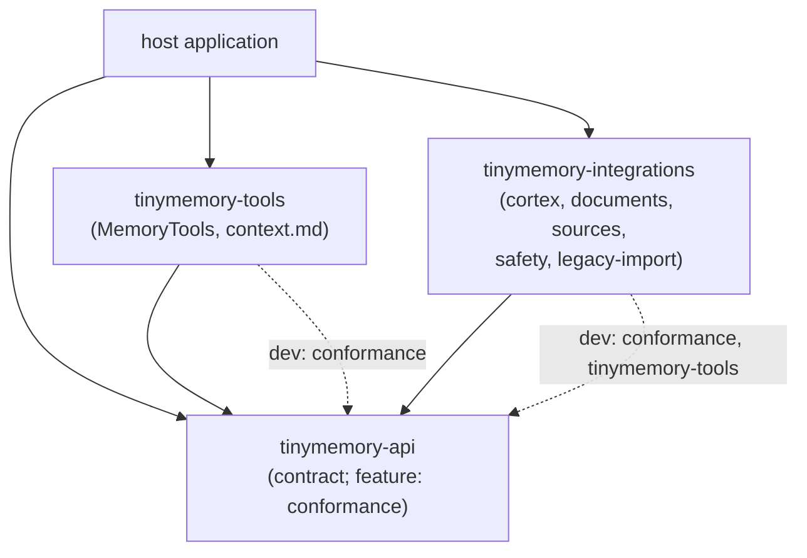

# Overview

TinyMemory gives an agent host memory it can write to, search and answer
questions from, without binding the host to one storage engine. A host needs
three operations (see [the spec](../specs/memory-v2.md)):

| Operation | Meaning |
| --- | --- |
| **Recall** | A question in, a synthesised answer with citations out. |
| **Fetch** | Raw keyword, vector or hybrid retrieval, filtered by metadata. |
| **Store** | Ingest a document, a conversation or a learning, each with typed metadata. |

plus `list`, `forget`, `explore` and `get` for paging, removal and browsing.

## The three parts

The workspace has three crates under `crates/`, split by what each is allowed
to depend on.

| Crate | Role | Why it is separate |
| --- | --- | --- |
| `tinymemory-api` | The **contract**: `MemoryEngine`, items, metadata, filters, namespaces, errors. With the `conformance` feature, the suite every engine must pass and an in-memory reference engine. | It performs no I/O and links no runtime, HTTP stack or storage engine, so an engine, a tool layer or a host can depend on it without inheriting anything else. |
| `tinymemory-tools` | The **agent surface**: `MemoryTools` (seven model-callable tools with JSON Schemas and host-fixed scoping), holistic recall and the `context.md` compiler, and the agent lifecycle — `AgentMemory`, `Brain`, `MemoryLayout`, background jobs (see [lifecycle.md](lifecycle.md)). | It works over any `MemoryEngine`, has no tool-runtime dependency, and is where "a model must never choose whose memory it touches" is enforced. |
| `tinymemory-integrations` | Everything that touches the **outside world**: the CortexDB engine, the engine registry and `MemoryConfig`, document conversion, source readers, safety scrubbing and the legacy v1 import. | Each integration is a Cargo feature, so a host pays only for the ones it uses. |

## Dependency graph



`tinymemory-tools` and `tinymemory-integrations` do not depend on each other at
runtime; the only link is a dev-dependency (`integrations` compiles
`context.md` from a live server in one test). Both depend on `tinymemory-api`
alone, so the contract is the only coupling point.

## Feature map

| Crate | Feature | Enables |
| --- | --- | --- |
| `tinymemory-api` | `conformance` | `conformance::run`, `conformance::ReferenceEngine`. No extra dependency. |
| `tinymemory-tools` | (none) | Every module (`tools`, `context`, `recall`, `layout`, `brain`, `lifecycle`, `background`) is always built. |
| `tinymemory-integrations` | `cortex` (default) | `cortex::CortexEngine` (both wires), `registry` (`list_engines`, `build_engine`), `config` (`MemoryConfig`) |
| | `documents` | Format sniffing and conversion to markdown |
| | `documents-office` | PDF, DOCX, PPTX, XLSX conversion (implies `documents`) |
| | `sources` | Readers for folders, files, conversations; Composio normalisers (implies `documents`) |
| | `sources-network` | GitHub, RSS and web-page readers behind the SSRF guard (implies `sources`) |
| | `safety` | Secret and PII scrubbing of a `StoreItem` |
| | `legacy-import` | Reading a v1 workspace; `import::migrate` and `migrate_with` |
| | `full` | `cortex`, `documents-office`, `sources-network`, `safety`, `legacy-import` |

## Write path

A write is a pipeline; every stage but the last is optional and lives in
`tinymemory-integrations`.

```text
source reader ──▶ documents ──▶ safety ──▶ engine.store ──▶ CortexDB
 (sources)      (conversion)    (scrub)     (contract)      (cortex)
```

1. **Source reader** (`sources`): lists a configured source (folder, file,
   link, GitHub, RSS, Composio payload, conversation) and reads each entry.
   `sources::collect_items` does this for one source; one bad entry lands in
   `Collected::skipped` instead of aborting the pass.
2. **Documents conversion** (`documents`): sniffs the format and converts the
   bytes to markdown, producing a `StoreItem::Document` whose body is
   `DocumentBody::Text` and whose `MemoryMeta` records where it came from
   (`file_path`, `language`, `source`, ...). The contract refuses a
   `DocumentBody::Uri`, so resolving a URI to text is a source's job.
3. **Safety scrub** (`safety`): `safety::scrub_item` redacts secrets and
   PII in every text the item carries and returns a `Sanitized<StoreItem>`
   with a report. The host decides to run it; the engine does not.
4. **`engine.store`** (or `store_many` for batches): the engine calls
   `StoreItem::validate`, derives the item's identity from
   `StoreItem::fingerprint`, and answers with a `StoreReceipt { id, replayed }`.
   See [operations.md](operations.md).
5. **CortexDB** (`cortex`): `CortexEngine` maps the item onto an experience
   in the scope for its kind and namespace. See [cortex.md](cortex.md).

An agent writing through `memory_store` skips steps 1 to 3: `MemoryTools`
builds a learning, document or conversation itself, stamps the host's
namespace and `observed_at`, and calls `engine.store`.

The legacy import is the same pipeline with a different source:
`import::migrate` reads a v1 workspace and feeds `store_many` in batches of at
most `MAX_STORE_MANY`.

## Read path

```text
model tool call ──▶ MemoryTools ──▶ engine.recall / fetch / list / get / explore ──▶ render
                    (scope pins                     (contract)                      (compact JSON)
                     reach)
```

1. **Tool call**: the host forwards a model's call to
   `MemoryTools::call(name, args)`.
2. **Scoping** (`tinymemory-tools`): arguments are read strictly (unknown
   keys, `namespace` and `reach` are refused), the model's `filter` is
   narrowed to a safe subset, and then `filter.reach` is **overwritten** with
   the host's `ToolScope::reach`. See [tools.md](tools.md) and
   [namespaces.md](namespaces.md).
3. **Engine call**: `recall`, `fetch`, `list`, `get` or `explore` on the
   `MemoryEngine`. The engine validates the request, then applies the filter,
   including its reach, to decide which items are visible.
4. **Render**: results become compact JSON (`{hits: [...]}`,
   `{answer, citations}`, ...) with scores rounded and only a subset of
   metadata; the namespace is never rendered.

`context.md` takes the same engine calls (`recall` per brief, `list` of
learnings) from a host rather than a model, with `ContextSpec::reach` playing
the role of the scope.

## Where each concern lives

| Concern | Lives in |
| --- | --- |
| The operations, item model, metadata and filters | `tinymemory-api` (`engine`, `item`, `meta`, `query`, `explore`) |
| Whose memory an item is and who can read it | `tinymemory-api::namespace`; enforced by the engine on `filter.reach`, pinned for models by `tinymemory-tools` |
| Validation of requests | `validate` methods in `tinymemory-api`; every engine calls them first |
| Idempotency (replay) | `StoreItem::fingerprint` in `tinymemory-api`; each engine derives its ids from it |
| Error classification | `tinymemory_api::Error` |
| Does an engine obey the contract | `tinymemory_api::conformance` |
| What a model may do | `tinymemory-tools::tools` |
| Session briefing | `tinymemory-tools::context` |
| Choosing and building an engine | `tinymemory-integrations::{registry, config}` |
| The CortexDB engine | `tinymemory-integrations::cortex` |
| Turning files and feeds into items | `tinymemory-integrations::{documents, sources}` |
| Secrets and PII | `tinymemory-integrations::safety` |
| v1 migration | `tinymemory-integrations::import` |
